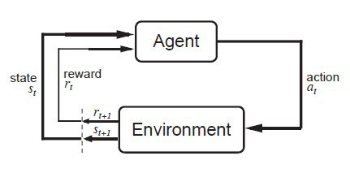

# Basics and Defintions

- What is reinforcement learning(RL)?  
RL is a kind of machine learning in which the agent learns to behave
in an environment by observing the results of its actions.
- There are 3 approaches to RL: value based, policy based and model based.
- The goal of an RL 'agent' is to maximise the 'expected cumulative reward'.
- RL algorithms are a set of ML algorithms inspired by behavioural psychology.
### Definitions
- Agent: The entity which takes action is known as the agent(basically our algorithm!)
- Action(A): Actions are the set of all possible moves that an agent can make.
- Environment: The world in which the agent takes action(in model-based RL, this can
be considered as a black box which we must attempt to approximate).
- State(S): The instantaneous configuration of the environment.
- Reward(R): Feedback by which we measure the success or failure of the agent's actions.
Rewards can be immediate or delayed. When we just say reward, we usually mean the immediate one.
Tehy are the central idea of 'RL'.
- Discount(gamma): This is basically a fight against delayed gratification. Powers of gamma are multiplied
by future rewards discovered by the agent to decrease their influence on the action which the agent chooses.
- Policy(pi): Strategy that the agent employees to determine the next action based on
the current state. A policy maps a state to action(s). The policy can be deterministic or stochastic.  
- Value(V): The expected long-term{as opposed to R, which is immediate} return with discount. Vpi(s) is defined as the expected long-term return
of the current state under policy pi.
- Q-value(aka action value): Similar to value, but it takes an extra parameter, the action 'a' as well.
Qpi(s) refers to the long term return of the current state s, taking action a under policy pi.
- Task: Instances of RL problems are called tasks. They can be episodic or continuous.

### The RL Loop

Note that it outputs a sequence of state, action and reward(in that order).
#### Types of RL
1. Value based: Tells us the maximum future expected reward the 
agent gets at each state.
2. Policy based: Directly optimize the policy function
action = pi(state). 
The policy function may be  
    - deterministic(return exactly 1 action for a state) or 
    - stochastic(probability distribution over actions).
This method directly indicates the best action to take.
3. Model based: In this we attempt to model the environment.

#### Types of Tasks
1. Episodic: Tasks with a START state and a TERMINAL state. Eg. Chess has a starting point(beginning of the game) and an ending point(win/draw/lose).
2. Continuous: Tasks with no TERMINAL state. The agent keeps running until stopped. Eg. Automated stock trading. 
*My philosophical reasoning: Our life is a continuous task as well...(unless rebirth happens + we have a memory of it).*

#### Monte Carlo and TD Learning Methods
- Monte Carlo: The rewards are received at the end of the episode. When the episode ends, the agent looks at the total cumulative reward to see how well it did. 
Then start a new game with this knowledge and make better decisions at every iteration. Hence this method is good for tasks which have an inherently episodic nature.
- TD learning implies update the value function at non terminal states using that experience only. Eg. TD(0) implies updating at each step.

#### Exploration and Exploitation 
- Exploration is finding more information about the environment.
- Exploitation is exploiting the known information to maximise the expected cumulative reward.

We have to strike a balance between the two. This is known as exploration/exploitation tradeoff.
